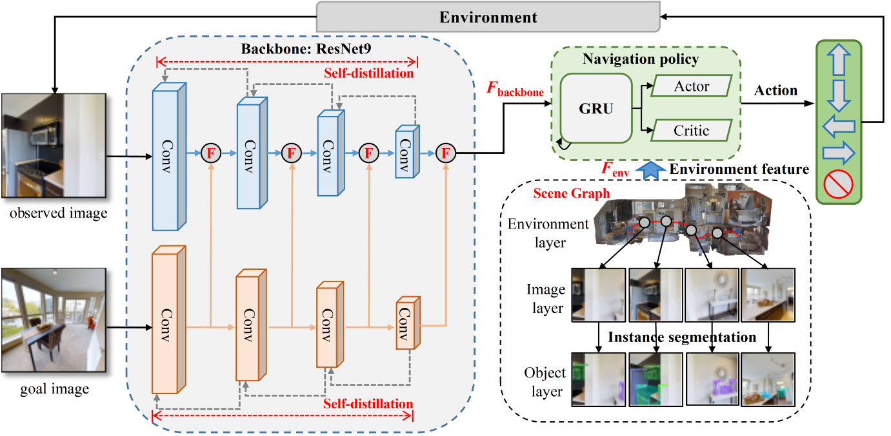

# RFSG
**This repository is the official implementation of the paper "Image-Goal Navigation Using Refined Feature Guidance
and Scene Graph Enhancement", which is submitted to IROS 2025**

In this paper, we introduce a novel image-goal navigation approach, named RFSG. Our focus lies in leveraging the
fine-grained connections between goals, observations, and the
environment within limited image data, all the while keeping the
navigation architecture simple and lightweight. To this end, we
propose the spatial-channel attention mechanism, enabling the
network to learn the importance of multi-dimensional features
to fuse the goal and observation features. In addition, a selfdistillation mechanism is incorporated to further enhance the
feature representation capabilities. Given that the navigation
task needs surrounding environmental information for more
efficient navigation, we propose an image scene graph to establish feature associations at both the image and object levels,
effectively encoding the surrounding scene information. Crossscene performance validation was conducted on the Gibson
and HM3D datasets, and the proposed method achieved stateof-the-art results among mainstream methods, with a speed of
up to 53.5 frames per second on an RTX3080. This contributes
to the realization of end-to-end image-goal navigation in realworld scenarios. 




## Implementation Steps

### 1. Prepare environment and data
Follow [FGPrompt](https://github.com/XinyuSun/FGPrompt) to install the habitat and download the required data

### 2. Train a agent in Gibson

```
python run.py --overwrite --exp-config exp_config/ddppo_imagenav_gibson.yaml,policy,reward,dataset,sensors,mid-fusion --run-type train --model-dir results/imagenav/RFSG
```

### 3. Evaluation in test dataset of Gibson or HM3D
Gibson's test dataset

```
python run.py --exp-config exp_config/ddppo_imagenav_gibson.yaml,policy,reward,dataset,sensors,mid-fusion,eval --run-type eval --model-dir results/imagenav_eval/RFSG habitat_baselines.eval_ckpt_path_dir Image goal/latest.pth
```

HM3D's test dataset

Choose from [val_easy, val_hard, val_medium]

```
python run.py --exp-config exp_config/ddppo_imagenav_gibson.yaml,policy,reward,dataset-hm3d,sensors,mid-fusion,eval --run-type eval --model-dir results/imagenav_eval/RFSG habitat_baselines.eval_ckpt_path_dir Image goal/latest.pth habitat_baselines.eval.split val_easy
```


## Citation

If you find this work helpful, please consider citing:

```bibtex
@article{feng2025image,
	title={Image-Goal Navigation Using Refined Feature Guidance
and Scene Graph Enhancement},
	author={Zhicheng Feng and Xieyuanli Chen and Chenghao Shi and Lun Luo and Zhichao Chen and Yun-Hui Liu and Huimin Lu},
	year={2025},
    url={https://arxiv.org/abs/xxxx}, 
}
```

